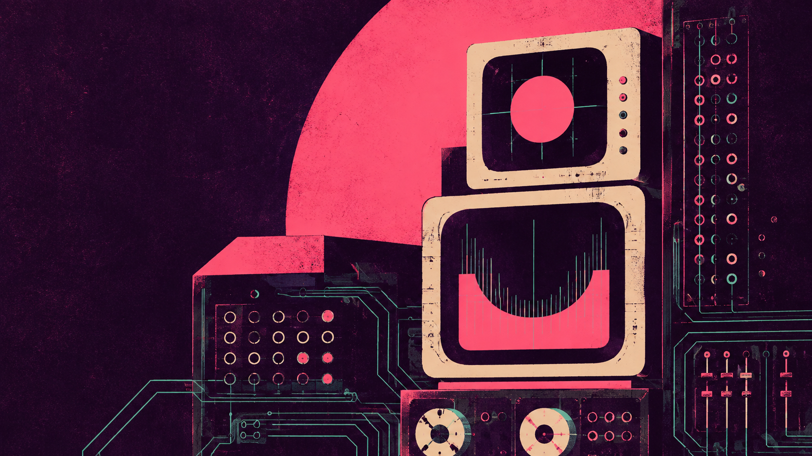

# Maniac Theme

A neon theme for [Omarchy](https://omarchy.org), inspired by Netflix's *Maniac*.
Hot pink, cream CRT housings, and fine mint circuitry printed over dark plum.
The wallpaper uses distressed silkscreen textures and flat ink shapes.



## Install

Requires Omarchy quattro with `colors.toml` themes and the Quickshell shell.

```sh
omarchy theme install https://github.com/eliasstravik/maniac-theme
```

Or open the Omarchy menu, choose **Install → Style → Theme**, and paste the
repository URL. The installed theme is named `maniac`.

To apply it again later:

```sh
omarchy theme set maniac
```

## Palette

| Role | Hex |
|---|---|
| Dark background | `#130c1c` |
| Application background | `#24152f` |
| Foreground | `#f6e4f3` |
| Accent | `#ff87d1` |
| Selection | `#472749` |
| Cyan | `#7ddbe4` |
| Green | `#85d9ac` |

The full palette is in [colors.toml](colors.toml). Omarchy generates supported
app colors from it. The shell overrides set plum backgrounds, pink borders and
active states, a 30px horizontal bar, and a matching launcher selection.

Theme format: [Omarchy theming documentation](https://github.com/basecamp/omarchy/blob/quattro/docs/theming.md).

## Wallpaper

The bundled PNG is 1672 × 941. It is original artwork generated with OpenAI's
built-in image tool, selected as Pink Circuit from the Afterimage theme studies.
The selected wallpaper and palette are preserved exactly.

## Validation

Palette and shell files validate as TOML. Wallpaper integrity, text contrast,
browser previews, and archive contents have been checked. Browser desktop views
are simulations; native Omarchy activation has not yet been tested.

## License

Theme files are MIT licensed. The wallpaper is dedicated to the public domain
under [CC0 1.0](https://creativecommons.org/publicdomain/zero/1.0/).
See [LICENSE](LICENSE).
